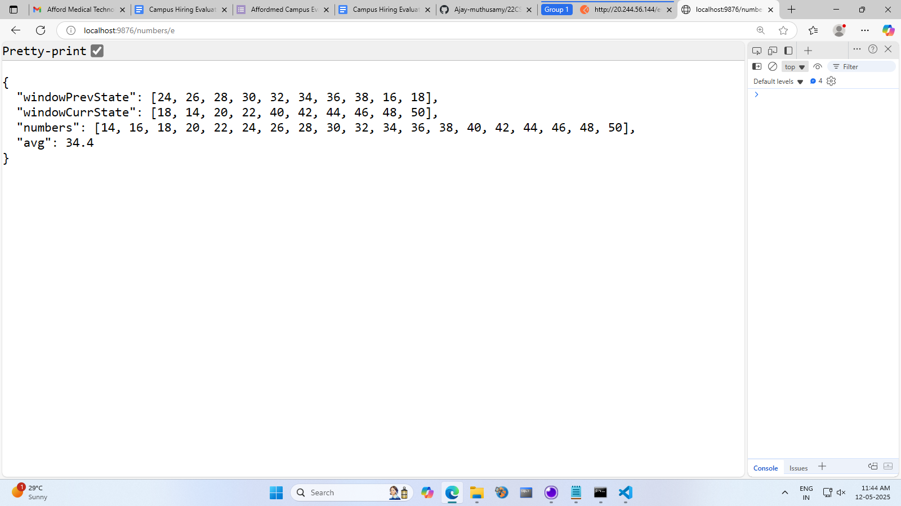
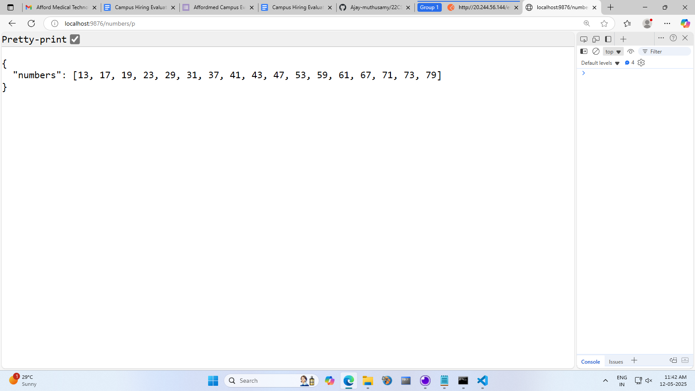
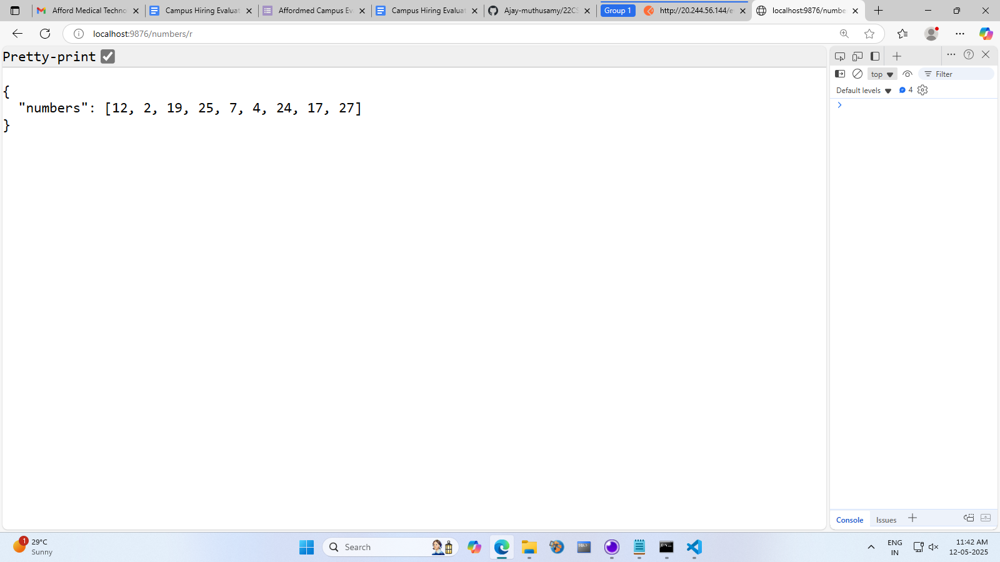

# Task Title
Average Calculator HTTP Microservice

# REQUEST(POST)
http://localhost:9876/numbers/e

# 1st Response

# 2nd RESPONSE

# Even Numbers API
# Request - http://localhost:9876/numbers/e
# Response 

# Prime Numbers API
# Request - http://localhost:9876/numbers/p
# Response 

# Fibonacci Numbers API
# Request - http://localhost:9876/numbers/f
# Response 

# Random Numbers API
# Request - http://localhost:9876/numbers/r
# Response 
